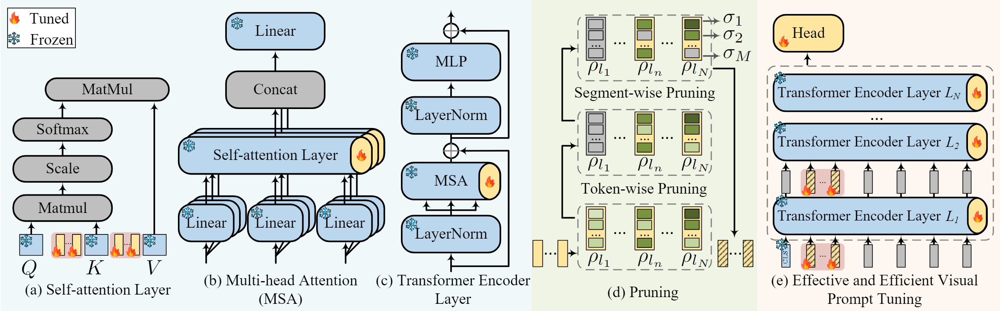

# E2VPT: An Effective and Efficient Approach for Visual Prompt Tuning
------

(👉Under construction! There are several redundancies in the current version, and the commands/instructions are not perfectly ready for formal release. I will gradually update it! Please stay tuned.)

This repository contains the official PyTorch implementation for E2VPT: An Effective and Efficient Approach for Visual Prompt Tuning. Our work is based on Visual Prompt Tuning [VPT](https://github.com/KMnP/vpt), and we thank the great work of them. 

As the size of transformer-based models continues to grow, fine-tuning these large-scale pretrained vision models for new tasks has become increasingly parameter-intensive. Parameter-efficient learning has been developed to reduce the number of tunable parameters during fine-tuning. Although these methods show promising results, there is still a significant performance gap compared to full fine-tuning. To address this challenge, we propose an Effective and Efficient Visual Prompt Tuning (E2VPT) approach for large-scale transformer-based model adaptation. Specifically, we introduce a set of learnable key-value prompts and visual prompts into self-attention and input layers, respectively, to improve the effectiveness of model fine-tuning. Moreover, we design a prompt pruning procedure to systematically prune low importance prompts while preserving model performance, which largely enhances the model's efficiency. Empirical results demonstrate that our approach outperforms several state-of-the-art baselines on two benchmarks, with considerably low parameter usage (e.g.,, 0.32% of model parameters on VTAB-1k). We anticipate that this work will inspire further exploration within the pretrain-then-finetune paradigm for large-scale models.

<div align="center">
  
</div>
<p align="center">
  Figure 1: Overview of our E2VPT framework. Under the pretrain-then-finetune paradigm, only the prompts in the transformer's input and backbone, are updated during the fine-tuning process, while all other components remain frozen. We further introduce pruning at two levels of granularity (i.e., token-wise and segment-wise) in (d) to eliminate unfavorable input prompts during rewinding.
</p>

## Environment settings

See `env_setup.sh`

Note that you need to add a file (which is put in timm_added folder) to timm/models with path `anaconda3/envs/[envs-name]/lib/python3.7/site-packages/timm/models`, and init it in `__init__.py` by adding `from .vision_transformer_changeVK import *`.

<!-- ## Structure of the this repo (Many thanks to VPT, key files are marked with 👉):

- `src/configs`: handles config parameters for the experiments.
  
  * 👉 `src/config/config.py`: <u>main config setups for experiments and explanation for each of them. </u> 

- `src/data`: loading and setup input datasets. The `src/data/vtab_datasets` are borrowed from 

  [VTAB github repo](https://github.com/google-research/task_adaptation/tree/master/task_adaptation/data).


- `src/engine`: main training and eval actions here.

- `src/models`: handles backbone archs and heads for different fine-tuning protocols 

    * 👉`src/models/vit_prompt`: <u>a folder contains the same backbones in `vit_backbones` folder,</u> specified for VPT. This folder should contain the same file names as those in  `vit_backbones`

    * 👉 `src/models/vit_models.py`: <u>main model for transformer-based models</u> ❗️Note❗️: Current version only support ViT, Swin and ViT with mae, moco-v3

    * `src/models/build_model.py`: main action here to utilize the config and build the model to train / eval.

- `src/solver`: optimization, losses and learning rate schedules.  
- `src/utils`: helper functions for io, loggings, training, visualizations. 
- 👉`train.py`: call this one for training and eval a model with a specified transfer type.
- 👉`tune_fgvc.py`: call this one for tuning learning rate and weight decay for a model with a specified transfer type. We used this script for FGVC tasks.
- 👉`tune_vtab.py`: call this one for tuning vtab tasks: use 800/200 split to find the best lr and wd, and use the best lr/wd for the final runs
- `launch.py`: contains functions used to launch the job.

## Experiments

### Key configs:

- 🔥VPT related:
  - MODEL.PROMPT.NUM_TOKENS: prompt length
  - MODEL.PROMPT.DEEP: deep or shallow prompt
- Fine-tuning method specification:
  - MODEL.TRANSFER_TYPE
- Vision backbones:
  - DATA.FEATURE: specify which representation to use
  - MODEL.TYPE: the general backbone type, e.g., "vit" or "swin"
  - MODEL.MODEL_ROOT: folder with pre-trained model checkpoints
- Optimization related: 
  - SOLVER.BASE_LR: learning rate for the experiment
  - SOLVER.WEIGHT_DECAY: weight decay value for the experiment
  - DATA.BATCH_SIZE
- Datasets related:
  - DATA.NAME
  - DATA.DATAPATH: where you put the datasets
  - DATA.NUMBER_CLASSES
- Others:
  - RUN_N_TIMES: ensure only run once in case for duplicated submision, not used during vtab runs
  - OUTPUT_DIR: output dir of the final model and logs
  - MODEL.SAVE_CKPT: if set to `True`, will save model ckpts and final output of both val and test set -->

## Experiments

### Key configs:

- E^2VPT related:
  - MODEL.P_VK.NUM_TOKENS: prompt length on Value-Key pair
  - MODEL.P_VK.NUM_TOKENS_P: prompt length (similar to VPT, but with pruning and rewinding)
  <!-- - MODEL.P_VK.DEEP: deep or shallow prompt -->
- Fine-tuning method specification ("P_VK" as default method for E^2VPT):
  - MODEL.TRANSFER_TYPE
- Vision backbones:
  - DATA.FEATURE: specify which representation to use
  - MODEL.TYPE: the general backbone type, e.g., "vit" or "swin"
  - MODEL.MODEL_ROOT: folder with pre-trained model checkpoints
- Optimization related: 
  - SOLVER.BASE_LR: learning rate for the experiment
  - SOLVER.WEIGHT_DECAY: weight decay value for the experiment
  - DATA.BATCH_SIZE
- Datasets related:
  - DATA.NAME
  - DATA.DATAPATH: where you put the datasets
  - DATA.NUMBER_CLASSES
- Others:
  - OUTPUT_DIR: output dir of the final model and logs

### Datasets preperation:

As I am having a hard time preparing for all of the datasets, I am considering to release a compiled version of FGVC and VTAB-1k sooner or later. For now, you can follow the instructions in [VPT](https://github.com/KMnP/vpt) for more details. We strictly follow the same datasets setup as VPT.

### Pre-trained model preperation

Download and place the pre-trained Transformer-based backbones to `MODEL.MODEL_ROOT`. Note that you also need to rename the downloaded ViT-B/16 ckpt from `ViT-B_16.npz` to `imagenet21k_ViT-B_16.npz`.

See Table 9 in the Appendix for more details about pre-trained backbones.


<table><tbody>
<!-- START TABLE -->
<!-- TABLE HEADER -->
<th valign="bottom">Pre-trained Backbone</th>
<th valign="bottom">Pre-trained Objective</th>
<th valign="bottom">Link</th>
<th valign="bottom">md5sum</th>
<!-- TABLE BODY -->
<tr><td align="left">ViT-B/16</td>
<td align="center">Supervised</td>
<td align="center"><a href="https://storage.googleapis.com/vit_models/imagenet21k/ViT-B_16.npz">link</a></td>
<td align="center"><tt>d9715d</tt></td>
</tr>
<tr><td align="left">ViT-B/16</td>
<td align="center">MoCo v3</td>
<td align="center"><a href="https://dl.fbaipublicfiles.com/moco-v3/vit-b-300ep/linear-vit-b-300ep.pth.tar">link</a></td>
<td align="center"><tt>8f39ce</tt></td>
</tr>
<tr><td align="left">ViT-B/16</td>
<td align="center">MAE</td>
<td align="center"><a href="https://dl.fbaipublicfiles.com/mae/pretrain/mae_pretrain_vit_base.pth">link</a></td>
<td align="center"><tt>8cad7c</tt></td>
</tr>
<tr><td align="left">Swin-B</td>
<td align="center">Supervised</td>
<td align="center"><a href="https://github.com/SwinTransformer/storage/releases/download/v1.0.0/swin_base_patch4_window7_224_22k.pth">link</a></td>
<td align="center"><tt>bf9cc1</tt></td>
</tr>
</tbody></table>

<!-- ### Examples for training and aggregating results

See [`demo.ipynb`](https://github.com/KMnP/vpt/blob/main/demo.ipynb) for how to use this repo. -->

### Hyperparameters for experiments in paper

We will release the hyperparameters for all experiments in the paper soon. Stay tuned!

## Citation

If you find our work helpful in your research, please cite it as:

```
@inproceedings{cheng2023e2vpt,
  title={E2VPT: An Effective and Efficient Approach for Visual Prompt Tuning},
  author={Cheng, Han and Qifan, Wang and Yiming, Cui and Zhiwen, Cao and Wenguan, Wang and Siyuan, Qi and Dongfang, Liu},
  booktitle={International Conference on Computer Vision (ICCV)},
  year={2023}
}
```

## License

The majority of VPT is licensed under the CC-BY-NC 4.0 license (see [LICENSE](https://github.com/KMnP/vpt/blob/main/LICENSE) for details). Portions of the project are available under separate license terms: GitHub - [google-research/task_adaptation](https://github.com/google-research/task_adaptation) and [huggingface/transformers](https://github.com/huggingface/transformers) are licensed under the Apache 2.0 license; [Swin-Transformer](https://github.com/microsoft/Swin-Transformer), [ConvNeXt](https://github.com/facebookresearch/ConvNeXt) and [ViT-pytorch](https://github.com/jeonsworld/ViT-pytorch) are licensed under the MIT license; and [MoCo-v3](https://github.com/facebookresearch/moco-v3) and [MAE](https://github.com/facebookresearch/mae) are licensed under the Attribution-NonCommercial 4.0 International license.
